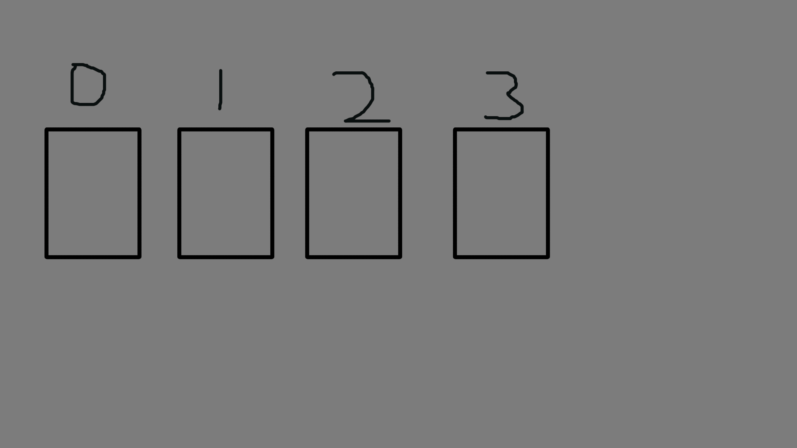

# DATA STRUCTURES --- ( PYTHON 🐍)

Data structures is a way of storage data in the computer memory for then recovery it. There are different data structures and the one you use in your algorithm must be adapted to the type of program that you must solve, since depending on the structure you use will affect the efficiency of your program.

**For example:** 

if you have a program that manages a huge research catalog and you constantly have to search, update and add new research in different catalog indexes. no matter how efficient your algorithms are to perform these operations if you use the wrong data structure, the program will not be as efficient as it should be ( **BIG O NOTATION** ).

Next I will be explaining as precisely as possible some of the most used data structures.

### CONTENTS:

* [Arrays](#ARRAYS)
* [Linked List](#LINKED)
* [Stacks](#STACKS)

## ARRAYS

Arrays are the most common implementations of lists in many programming languages.

Depending on the programming language, the arrays have different characteristics such as: you have to define the size they will have, you cannot store different values in the same array, etc.

As I mentioned earlier, these characteristics do not apply to all languages, what we must take into account are the following things:

* The arrays are ordered.
* All the values stored in the array have an index with which we can access their value, this starts from 0.
* It is easy to add elements at the end, the thing is complicated when you must add elements in specific places of the matrix since to do this the other elements that are in front must be pushed, in general this process is usually an O (n).

**FOR MORE SEE THE FILE arrays.py IN SRC**

## LINKED LIST

Linked lists, unlike arrays, do not handle indexes so you cannot access them in a common way, like this: list [0].

By convention, generally the elements within the linkedlist are called nodes. These nodes contain a value and the reference to the next element.

BIG O NOTATION

**SEARCH** --> O(n)

**ACCESS** --> O(n)

**DELETE** --> O(1)

**INSERT** --> O(1)

**FOR MORE SEE THE FILE linked_list.py IN SRC**